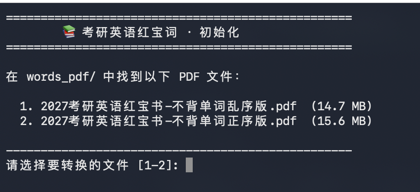
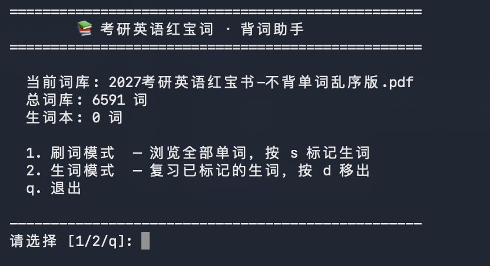
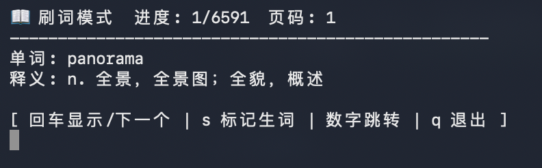
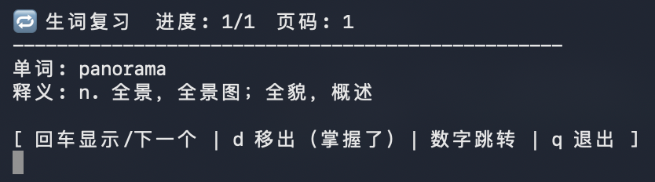

# 不背单词 · PDF 背词助手

 | 
--- | ---
 | 

从 **不背单词 App** 导出的 A4 默写纸 PDF 中提取单词与释义，在终端中刷词。离线、无广告、伪装性强。

> 🧑‍🎓 **适合人群**
>
> - 🎯 **考研 / 四六级 / 雅思托福备考** — 反复刷词
> - 🤫 **上班族** — 终端界面看起来像写代码，领导路过也看不出来你在背单词

---

## 环境依赖

| 依赖 | 说明 |
|------|------|
| **Python 3.8+** | 在终端运行 `python3 --version` 查看版本。未安装则从 [python.org](https://python.org) 下载 |
| **PyMuPDF** | PDF 解析库，执行下方教程第二步自动安装 |

---

## 使用教程

### 1️⃣ 下载项目

```bash
git clone <项目地址>
cd <项目目录>
```

### 2️⃣ 安装依赖

```bash
pip install -r requirements.txt
```

> `pip` 报错就试 `pip3`。

### 3️⃣ 导出 PDF

在不背单词 App 中：进入词书 → 右下角「…」→ 默写 → 选择 **A4 默写纸** → 导出。

将导出的 PDF 放入项目目录的 `words_pdf/` 文件夹（没有就新建一个）。

> ⚠️ 仅适配 **A4 默写纸** 格式，其他排版无法提取。

### 4️⃣ 初始化词库

```bash
python init.py
```

选择你要用的 PDF：

```
在 words_pdf/ 中找到以下 PDF 文件：

  1. 考研词汇_乱序版.pdf  (15.5 MB)
  2. 六级词汇_正序版.pdf  (12.3 MB)

请选择要转换的文件 [1-2]:
```

等待提示 **初始化完成**。

### 5️⃣ 开始背词

```bash
python word_cli.py
```

#### 刷词模式

```
📖 刷词模式  进度: 1/6591  页码: 1
--------------------------------------------------
单词: panorama

[ 回车显示/下一个 | s 标记生词 | 数字跳转 | q 退出 ]
```

| 按键 | 效果 |
|------|------|
| **回车** | 首次→显示释义；再次→下一个单词 |
| **s** | 这个还不会 → 存入生词本 |
| **数字** (如 `500`) | 跳转到第 500 个词 |
| **q** | 退出 |

> 💡 **背词建议**：先看单词想释义，再回车确认。不会的按 `s` 收集，刷完一轮再集中复习生词。

#### 生词模式

```
🔁 生词复习  进度: 1/12  页码: 15
--------------------------------------------------
单词: ambiguous

[ 回车显示/下一个 | d 移出（掌握了）| 数字跳转 | q 退出 ]
```

| 按键 | 效果 |
|------|------|
| **回车** | 显示释义 / 下一个 |
| **d** | 已掌握 → 从生词本移出 |
| **数字** | 跳转 |
| **q** | 退出 |

---

## 常见问题

**提示「尚未初始化词库」？**
→ 先运行 `python init.py`。

**想换词库？**
→ 重新运行 `init.py` 选择另一个 PDF，配置自动更新。

**生词会丢吗？**
→ 不会。存储在 `data/hard_words.json`，关终端再开还在。

**换电脑怎么迁移？**
→ 拷贝 `data/` 目录到新项目即可。词库 JSON 重新 `init.py` 生成。

**按键没反应？**
→ 检查是否在英文输入法状态。

**不背单词怎么导出？**
→ 词书 → 右下角「…」→ 默写 → A4 默写纸。

**支持其他 App？**
→ 仅适配不背单词的 A4 默写格式。

---

## 声明

- 本工具仅提供 PDF 解析与终端背词功能，**不包含**任何词书 PDF。
- PDF 请通过不背单词 App 自行导出，词书版权归原出版社所有。
- 本工具仅供个人学习使用。
